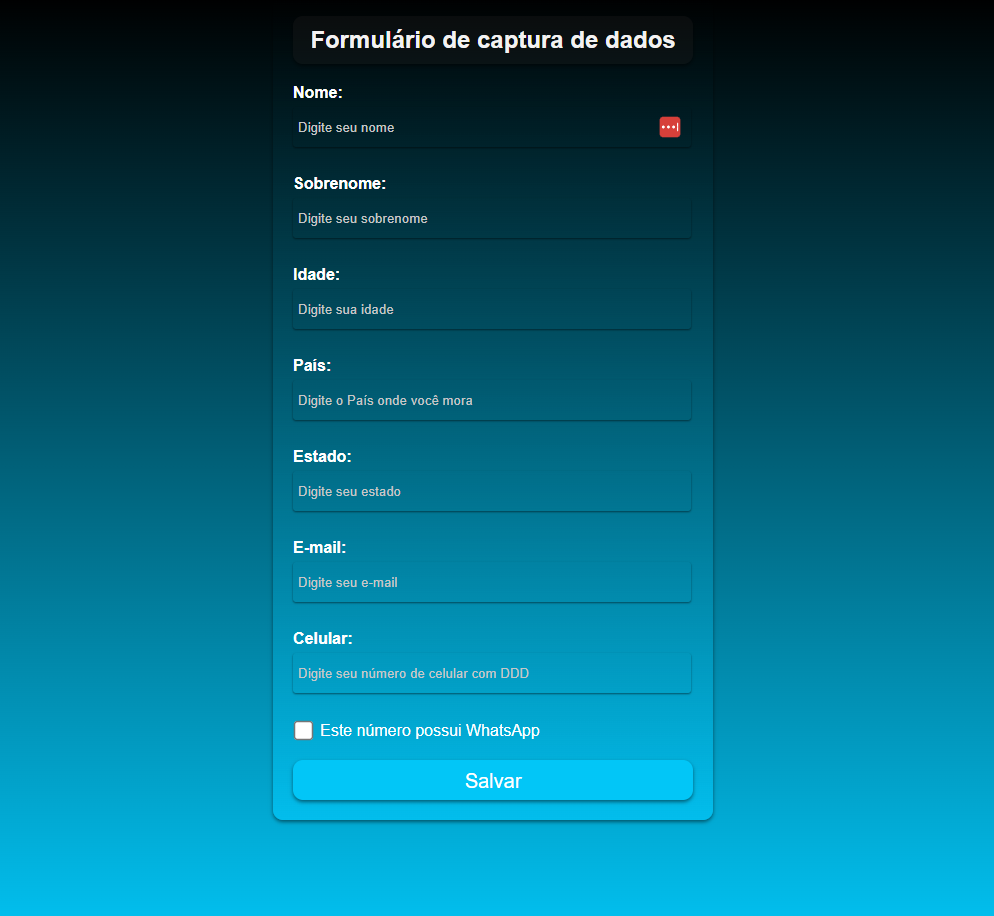
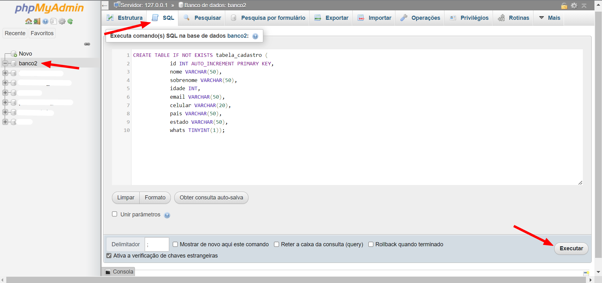
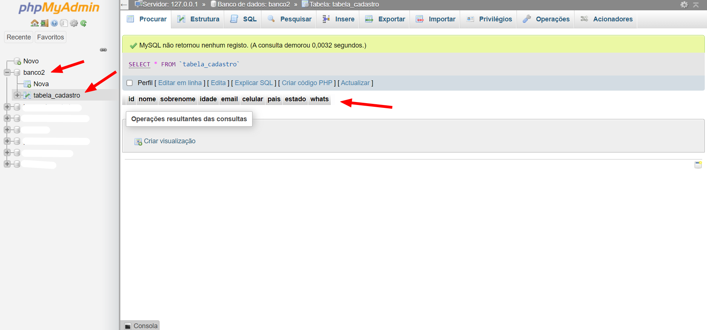
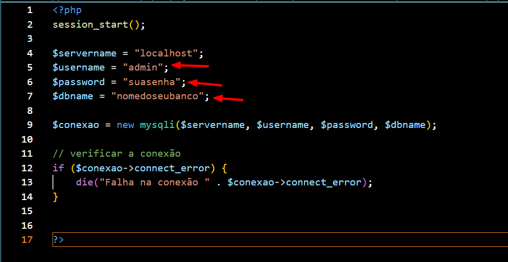
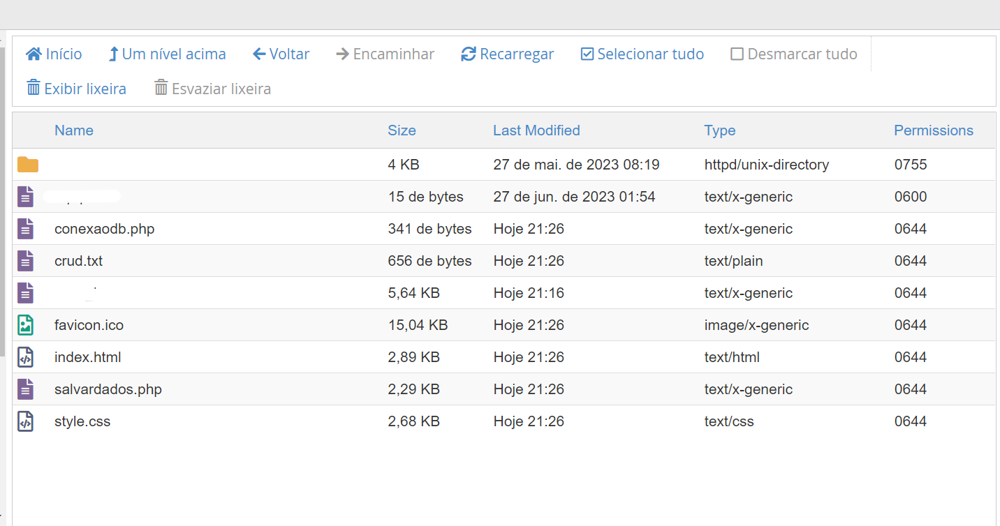

# Formulário de captura de dados  

Nível de dificuldade na compreensão e recursos utilizados:  
▰▰▰▱▱▱▱▱▱▱ (Iniciante) 

Nível de dificuldade na instalação do projeto:  
▰▰▱▱▱▱▱▱▱▱ (Fácil)   
# Índice
- [Sobre o projeto](#sobre)
- [O que você precisa ter em mãos?](#oquevoceprecisa)
- [Funcionalidades](#funcionalidades)
- [Layout do projeto](#layout-do-projeto)
- [Como rodar o projeto?](#como-rodar-o-projeto)
- [Tecnologias utilizadas](#tecnologiasusadas)
- [Como contribuir com o projeto?](#comocontribuir)
- [Quem desenvolveu esse projeto?](#desenvolvedor)

## Sobre

O projeto é um formulário que captura os dados do usuário e adiciona a um banco de dados MySql. Esse processo é feito utilizando de vários recursos de segurança para evitar ataques como "SQL Injection". 
 

Este formulário pode ser usado de base para qualquer outro projeto, basta alterar o arquivo style.css e conecta-lo as outras páginas do seu site/sistema.

## ✍️ O que você precisa ter em mãos?
- Hospedagem ou servidor próprio
- Banco de dados criado na sua hospedagem ou servidor
- Usuário criado e adicionado com todos os privilégios ao banco a cima 👆
- Senha de acesso deste usuário ao banco de dados

## ✅ Funcionalidades
- Captura os dados do usuário;
- Adiciona os dados as variáveis do PHP;
- Sanitiza os dados e verifica a duplicidade;
- Prepara os dados usando "prepared statements" para evitar que os dados sejam interpretados como comandos SQL;
- Adiciona os dados a um banco de dados;
- Emite um alerta de sucesso/erro ao salvar os dados.

## 🖥️  Layout do projeto   
      

## 💻 Como rodar o projeto?
#### *O passo a passo a seguir serve para instalar o projeto em uma hospedagem ou em um servidor próprio.
#### *Se você desejar instalar em um servidor próprio, o processo é análogo ao processo de instalar na hospedagem, porém o link de acesso ao formulário é o IP do seu servidor ou localhost.
- Baixe a pasta root.zip do projeto e extraia no seu computador;
- Dentro da pasta root existe um arquivo chamado "crud.txt", você deve abrir esse arquivo, copiar o conteúdo do comando SQL que há nele e colar ele no seu console SQL, após isso basta executar o comando, como no print a baixo: 

- Após executar o comando no seu console SQL, será criada a tabela necessária para a grupar os dados recebidos e o seu banco de dados deve estar se parecendo com isso:

 

- Agora você precisa abrir o arquivo "conexaodb.php" com algum editor de texto e alterar os dados de conexão com o banco de dados;
- O arquivo "conexaodb.php" deve se parecer com o print a baixo. Você deve editar os campos "username", "password" e "dbname" e nesses campos você precisa adicionar os dados de acesso e nome do seu banco de dados onde deseja salvar os dados capturados pelo formulário;  
  **Essas informações de acesso você deve possuir desde o começo da instalação.
  
 

- Após adicionar os dados de acesso do seu banco de dados ao arquivo "conexaodb.php", você deve acessar a pasta raiz da sua hospedagem/servidor e lá adicionar todos os arquivos da pasta root do projeto: 
 
  
 
- Pronto! Agora seu o formulário já está abrindo e funcionando na sua hospedagem/servidor quando acessado pelo seu domínio/subdominio/IP.   

## 🔑 Tecnologias utilizadas
- HTML 5 
- CSS 3 
- PHP (Min. v5.6) 
- MySql
- JavaScript

                                                                                                                      

